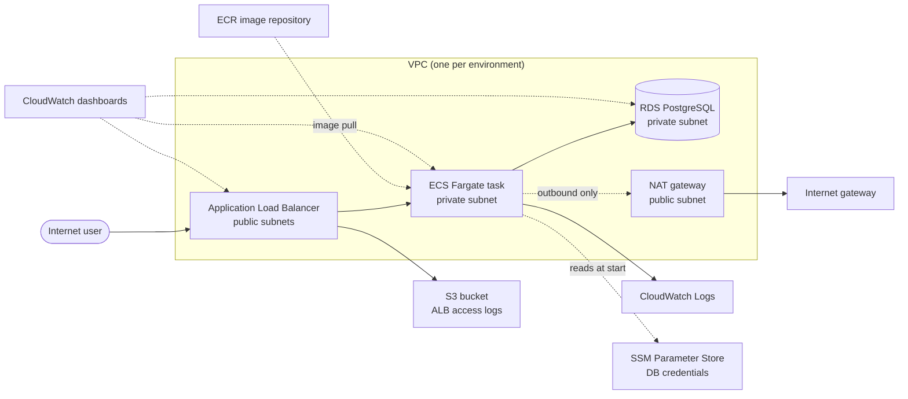
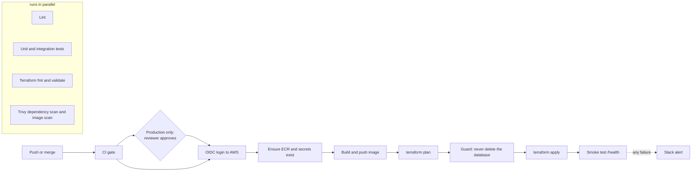

# aws-devops-infra-pipeline

A production-style AWS DevOps project: infrastructure written as code with **Terraform**, a **FastAPI + PostgreSQL** application running on **ECS Fargate**, three environments (**dev, qa, production**), and a **GitHub Actions** pipeline that tests, scans, builds and deploys with no stored AWS keys. Logs and metrics go to **CloudWatch** with two dashboards per environment.

> **About live URLs:** the environments are destroyed between work sessions to save cost, so any load balancer address would be temporary. The [Evidence](#13-evidence) section shows real output and screenshots captured while everything was running. The problems hit along the way are in [CHALLENGES.md](CHALLENGES.md).

## Contents

1. [What this project demonstrates](#1-what-this-project-demonstrates)
2. [Architecture](#2-architecture)
3. [Repository layout](#3-repository-layout)
4. [Environments, branches and promotion](#4-environments-branches-and-promotion)
5. [CI/CD pipeline](#5-cicd-pipeline)
6. [Design decisions](#6-design-decisions)
7. [Monitoring and logging](#7-monitoring-and-logging)
8. [Security considerations](#8-security-considerations)
9. [Secret management and backups](#9-secret-management-and-backups)
10. [Cost optimization](#10-cost-optimization)
11. [Getting started from zero](#11-getting-started-from-zero)
12. [Operations runbook](#12-operations-runbook)
13. [Evidence](#13-evidence)
14. [Limitations and next steps](#14-limitations-and-next-steps)
15. [How this was built](#15-how-this-was-built)

---

## 1. What this project demonstrates

| Area | What is in the repo |
|---|---|
| Infrastructure as code | Terraform modules for VPC, security groups, RDS, ALB, ECR, ECS, secrets and monitoring, reused by three environment folders |
| State management | Remote state in an encrypted, versioned S3 bucket with a DynamoDB lock table, one state file per environment |
| Environments | dev, qa and production, each fully separate (own VPC, database, load balancer, state) |
| CI | Lint, unit tests, integration tests against a real PostgreSQL, Terraform format and validate, dependency scan and container scan |
| CD | Build and push image, `terraform plan` and `apply`, smoke test, Slack alert on failure |
| Release control | develop deploys dev, qa deploys qa, main deploys production **behind a manual reviewer approval** |
| Authentication | GitHub OIDC to temporary AWS credentials, no access keys stored anywhere |
| Monitoring | Two dashboards per environment: infrastructure and application, plus centralized logs |
| Secrets | Database password generated by Terraform and kept in SSM Parameter Store as a SecureString |
| Backups | RDS automated backups with a configurable retention period, versioned Terraform state |

---

## 2. Architecture



### What each environment contains

| Layer | Resource | Notes |
|---|---|---|
| Network | VPC with 2 public and 2 private subnets in 2 availability zones | Separate address range per environment (10.0, 10.1, 10.2) |
| Network | Internet gateway, one NAT gateway, route tables | Private subnets reach the internet only through the NAT gateway |
| Security | Three security groups chained by reference | Internet to ALB on 80, ALB to app on 8000, app to database on 5432 |
| Entry | Application Load Balancer, target group (type `ip`, health check on `/health`) | Access logs written to a private S3 bucket (14-day lifecycle) |
| Compute | ECS cluster and Fargate service, 0.25 vCPU and 512 MB, one task | Private subnets, no public IP, deployment circuit breaker with rollback, Container Insights on |
| Data | RDS PostgreSQL 16, `db.t3.micro`, encrypted, not publicly accessible | Private subnets, automated backups |
| Images | ECR repository with scan on push | Keeps the last 10 images |
| Secrets | SSM parameters `/<env>/db/username` and `/<env>/db/password` | Password generated by Terraform, read by ECS at task start |
| Observability | Log group `/ecs/<env>-app` (7 days), two dashboards | See section 7 |

### The application

A small FastAPI service, used to give the infrastructure something real to run.

| Endpoint | Behaviour |
|---|---|
| `GET /health` | Returns `{"status":"ok"}`, deliberately does not touch the database so a brief database blip does not mark every task unhealthy |
| `GET /items` | Lists items from PostgreSQL |
| `POST /items` | Creates an item, title must be 1 to 200 characters, otherwise a structured `422` |
| `GET /docs` | Interactive API documentation generated from the code |

Configuration comes only from environment variables (`DB_HOST`, `DB_PORT`, `DB_NAME`, `DB_USER`, `DB_PASSWORD`). Logs go to stdout, which ECS ships to CloudWatch.

---

## 3. Repository layout

```
.
├── app/                         FastAPI app, tests, Dockerfile, docker-compose.yml, ruff.toml
├── scripts/
│   └── current-image-tag.sh     prints the image tag an environment is running right now
├── terraform/
│   ├── bootstrap/               applied once by hand (local state): state bucket, lock table,
│   │                            GitHub OIDC provider and deploy roles
│   ├── modules/                 reusable blueprints
│   │   ├── vpc/  security-groups/  secrets/  rds/  alb/  ecr/  compute/  monitoring/
│   └── environments/
│       ├── dev/  qa/  production/     main.tf, variables.tf, terraform.tfvars, outputs.tf
├── .github/workflows/
│   ├── ci.yml                   lint, tests, terraform checks, security scans (reusable)
│   ├── cd-dev.yml               deploy on push to develop
│   ├── cd-qa.yml                deploy on push to qa
│   └── cd-production.yml        deploy on push to main, after reviewer approval
├── docs/evidence/               screenshots referenced in this README
├── README.md
└── CHALLENGES.md
```

The environment folders contain only the backend, the provider and module calls. The logic lives in `modules/`. Only two things differ between environments: the values in `terraform.tfvars` and the state key in the backend block.

---

## 4. Environments, branches and promotion

| Environment | Branch | Trigger | Gate | State key | AWS access |
|---|---|---|---|---|---|
| dev | `develop` | push | CI must pass | `dev/terraform.tfstate` | role `github-actions-dev`, assumable only from `develop` |
| qa | `qa` | merge from develop | CI must pass | `qa/terraform.tfstate` | role `github-actions-qa`, assumable only from `qa` |
| production | `main` | merge from qa | CI must pass, then a **required reviewer must approve** | `production/terraform.tfstate` | role `github-actions-production`, assumable only by jobs in the `production` GitHub environment |

Promotion is a pull request: `develop` to `qa`, then `qa` to `main`. Opening a PR runs CI only. Deployment starts when the PR is **merged**, because the merge is the push that triggers the deploy workflow.

---

## 5. CI/CD pipeline



### Continuous integration (`ci.yml`)

Runs on pull requests and is reused by every deploy workflow, so nothing deploys unless it passes. The five jobs run in parallel:

| Job | What it checks |
|---|---|
| Lint | `ruff check` with a pinned version and a config that treats `app/` as the project root |
| Tests | Unit tests (no database) then integration tests against a throwaway **PostgreSQL 16 service container** |
| Terraform | `terraform fmt -check`, then `init -backend=false` and `validate` for **all three environments**, no AWS credentials needed |
| Trivy dependency scan | Python packages, fails on fixable HIGH or CRITICAL findings |
| Trivy image scan | Builds the image and scans OS packages and libraries, same policy |

### Continuous deployment (`cd-<env>.yml`)

1. **CI gate**: the reusable CI workflow must succeed.
2. **Approval (production only)**: the job pauses in the `production` GitHub environment until a required reviewer approves. The production AWS role trusts only that environment, so credentials cannot be obtained without the approval.
3. **OIDC login**: GitHub issues a short-lived token and AWS exchanges it for temporary credentials. No access keys are stored.
4. **Ensure ECR and secrets exist**: a targeted apply that creates the image repository and secrets on a brand-new environment and does nothing otherwise. The service cannot start without an image, so this ordering is what makes a rebuild from nothing work.
5. **Build and push**: image tagged with the short commit hash plus `latest`.
6. **Plan, guard, apply**: the plan is saved and applied exactly. A guard step fails the run if the plan would delete or replace the RDS instance.
7. **Smoke test**: retries `GET /health` through the load balancer until the new task is healthy.
8. **Alert**: a Slack message with the commit, author and run link if anything fails.

### How the pipeline authenticates

The trust policy of each deploy role matches one exact GitHub token subject:

| Role | Allowed subject |
|---|---|
| github-actions-dev | `repo:<owner>@<owner_id>/<repo>@<repo_id>:ref:refs/heads/develop` |
| github-actions-qa | `repo:<owner>@<owner_id>/<repo>@<repo_id>:ref:refs/heads/qa` |
| github-actions-production | `repo:<owner>@<owner_id>/<repo>@<repo_id>:environment:production` |

Permissions are `PowerUserAccess` plus IAM limited to roles named `<env>-*`, and `iam:PassRole` only to ECS tasks. The role cannot create users, access keys or OIDC providers, and it cannot edit its own `github-actions-*` role.

---

## 6. Design decisions

| Decision | Why | Trade-off |
|---|---|---|
| Modules plus one folder per environment, not workspaces | Each environment is explicit and visible in a pull request, hard to apply to the wrong one | A few small duplicated files |
| One state file per environment | A bad apply in one cannot touch another | More state files to manage |
| One NAT gateway per environment, not per availability zone | Cost: a NAT gateway is the single biggest line item | An AZ failure would cut outbound internet for that environment |
| Fargate, not EC2 | No servers to patch or size, pay only while tasks run | Slightly higher unit cost than EC2 at scale |
| Single-AZ `db.t3.micro` | Cost and account limits | No database failover. `multi_az` is a variable, off by default |
| SSM Parameter Store, not Secrets Manager | No per-secret fee | No automatic rotation |
| Password generated by Terraform | No human ever sees or types it | It is stored in Terraform state, so the state bucket is encrypted and locked down |
| `/health` does not query the database | A database blip should not restart every task | A broken database connection is not caught by the load balancer check |
| Pipeline owns the image tag | The tag is passed with `-var image_tag=<commit>`, never kept in tfvars, so there is one writer | Manual runs must pass the tag, see the helper script |
| Bootstrap kept out of the pipeline | The pipeline cannot widen its own permissions, and bootstrap creates what the pipeline needs to log in | Applied by hand, state is local |

---

## 7. Monitoring and logging

### Dashboards (two per environment)

| Dashboard | Widgets |
|---|---|
| `<env>-infrastructure` | ECS CPU, memory, running tasks, Fargate ephemeral storage (disk), network in and out. RDS CPU, connections, free storage, freeable memory, read and write latency, IOPS |
| `<env>-application` | Request rate, 5XX error rate as a percentage (metric math), 4XX and 5XX counts, average and p95 latency, healthy and unhealthy targets, a live table of recent application logs |

### Centralized logs

| Log | Where | Retention |
|---|---|---|
| Application logs (stdout) | CloudWatch Logs group `/ecs/<env>-app` | 7 days |
| Load balancer access logs | Private S3 bucket `<env>-alb-access-logs-<account>`, encrypted, public access blocked | 14 days |
| Container and service events | ECS service events and Container Insights | managed by AWS |

```bash
aws logs tail /ecs/<env>-app --since 10m --region ap-south-1
```

---

## 8. Security considerations

### Implemented

- **No stored credentials.** GitHub OIDC with exact-match trust on repo and branch or environment.
- **Least privilege.** Deploy roles cannot manage users, keys or their own trust. The ECS execution role can read only its two SSM parameters.
- **Network isolation.** The application and the database run in private subnets with no public IP. Security groups reference each other, so each tier accepts traffic only from its neighbour.
- **Encryption.** RDS storage, the state bucket and the log buckets are encrypted at rest. Public access is blocked on every bucket.
- **Secrets never in code.** No password in Terraform files, tfvars, workflows or git history. The history was scanned for keys, webhook URLs and state files before the repository was made public.
- **Supply chain.** Third-party actions are pinned to full commit SHAs and used sparingly. Python dependencies are pinned. The container runs as a non-root user and OS packages are patched at build time.
- **Vulnerability gate.** Builds fail on fixable HIGH or CRITICAL findings in dependencies or the image.
- **Release control.** Manual reviewer approval and a branch restriction on the production environment.
- **Blast-radius guard.** The pipeline refuses to apply a plan that deletes the database.
- **Public repository hardening.** Fork pull requests cannot read secrets or assume AWS roles, because the trust policy matches this repository and branch only.

### Known risks

| Risk | Status |
|---|---|
| HTTP only, no TLS | Needs a domain and a certificate. Do not send sensitive data |
| The API has no authentication, `/docs` is public | Fine for a demo, would need auth for real use |
| One HIGH finding in the system `zlib` library with no Debian fix yet | Accepted and documented. The vulnerable code path needs `gzprintf` after a stalled non-blocking write, which this app does not use. The base image is re-patched on every build |
| Bootstrap state is a local file | Back it up, or migrate it into the bucket with `terraform init -migrate-state` |
| Deploy roles use `PowerUserAccess`, not resource-scoped | Mitigated by the exact-match trust policy. A tighter policy is a next step |
| Terraform state contains the generated password | State bucket is encrypted, versioned and private |

---

## 9. Secret management and backups

**Secret management.** `random_password` generates a 24-character password using a character set RDS accepts. It is stored as an SSM `SecureString` at `/<env>/db/password`, and the username at `/<env>/db/username`. The ECS task definition references the parameters, so ECS injects them as `DB_USER` and `DB_PASSWORD` at task start. The password is never printed and never appears in a file. The application builds the connection with SQLAlchemy's `URL.create`, which handles special characters in the password.

**Backups.**

| What | How |
|---|---|
| Database | RDS automated backups, retention set by `db_backup_retention_period` (1 day here, because the free-plan account limits it). A real production account should use 7 days or more |
| Database final snapshot | `skip_final_snapshot` is a variable: true in dev for fast teardown, would be false in production |
| Terraform state | S3 versioning on the state bucket, so previous states can be recovered |
| Images | ECR keeps the last 10, which doubles as a rollback history |

---

## 10. Cost optimization

### Measures taken

| Measure | Effect |
|---|---|
| Fargate at 0.25 vCPU and 512 MB, one task | Smallest sizing that runs the app |
| Single-AZ `db.t3.micro` with a small gp3 volume | Cheapest database that fits |
| One NAT gateway per environment | NAT is the largest fixed cost |
| SSM Parameter Store instead of Secrets Manager | Avoids a per-secret monthly fee |
| Log retention 7 days, ALB log lifecycle 14 days, ECR keeps 10 images | Storage stays near zero |
| Everything is code, so it is destroyed when idle and rebuilt by the pipeline | Idle cost is zero |
| Billing budget and anomaly detection enabled | Early warning |

### What it actually cost

From the AWS Billing console on October 8, 2026 (account on the free plan, so credits covered the charges):

| Period | Cost |
|---|---|
| September 2026 | **$19.64** |
| October 1 to 8 | **$14.90** |

By my estimate roughly 90% of that came from the **dev NAT gateway running continuously for about three weeks**. The lesson: destroy an environment when it is idle, because the pipeline can rebuild it from nothing in about 10 to 15 minutes. As an approximation, one running environment costs about $0.13 to $0.15 per hour (NAT gateway, load balancer, database, one task and public IP addresses).

### Teardown (order matters)

```bash
# 1. stop the pipeline from rebuilding it on the next push
gh workflow disable cd-<env>.yml

# 2. empty the load balancer log bucket (a non-empty bucket cannot be deleted)
aws s3 rm s3://<env>-alb-access-logs-<account-id> --recursive

# 3. destroy the whole environment
cd terraform/environments/<env>
terraform plan -destroy -var image_tag=latest | tail -3
terraform destroy -var image_tag=latest
```

Then confirm nothing billable is left. Every command should print nothing:

```bash
aws ec2 describe-nat-gateways --region ap-south-1 --filter Name=state,Values=available,pending --query 'NatGateways[].NatGatewayId' --output text
aws elbv2 describe-load-balancers --region ap-south-1 --query 'LoadBalancers[].LoadBalancerName' --output text
aws rds describe-db-instances --region ap-south-1 --query 'DBInstances[].DBInstanceIdentifier' --output text
aws rds describe-db-snapshots --region ap-south-1 --query 'DBSnapshots[].DBSnapshotIdentifier' --output text
aws ec2 describe-addresses --region ap-south-1 --query 'Addresses[].PublicIp' --output text
aws ecs list-clusters --region ap-south-1 --query clusterArns --output text
aws s3 ls | grep alb-access-logs || echo "no log buckets"
```

What stays after a full teardown and costs essentially nothing: the state bucket, lock table, OIDC provider, deploy roles and the repository itself.

---

## 11. Getting started from zero

### Prerequisites

AWS account and CLI (`aws configure`), Terraform 1.16 or newer, Docker, Git, the GitHub CLI (`gh auth login`), Python 3.12.

### 1. Run the application locally

```bash
cd app
python3 -m venv .venv && source .venv/bin/activate
pip install -r requirements-dev.txt
ruff check .
docker compose up -d                       # local PostgreSQL
export DB_HOST=localhost DB_USER=appadmin DB_PASSWORD=localpass DB_NAME=appdb
pytest -m "not integration" -v             # unit tests, no database needed
pytest -m integration -v                   # integration tests against the real database
docker compose down
```

The password `localpass` belongs to a throwaway container that exists only while the tests run.

Build and run the container itself:

```bash
docker build -t dev-app:local .
docker compose up -d
docker run --rm -d --name app-test --network app_default -p 8000:8000 \
  -e DB_HOST=postgres -e DB_USER=appadmin -e DB_PASSWORD=localpass -e DB_NAME=appdb dev-app:local
curl localhost:8000/health
docker stop app-test && docker compose down
```

### 2. Create the foundation (once)

The backend block cannot use variables, so first change the S3 bucket and DynamoDB table names (bucket names are globally unique) in `terraform/bootstrap/main.tf` and in each `terraform/environments/*/main.tf`, and the account ID in the three `cd-*.yml` files (`AWS_ROLE_ARN`).

```bash
cd terraform/bootstrap
gh api repos/<owner>/<repo> --jq '"github_owner = \"\(.owner.login)\"\ngithub_owner_id = \"\(.owner.id)\"\ngithub_repo_name = \"\(.name)\"\ngithub_repo_id = \"\(.id)\""' > terraform.tfvars
terraform init
terraform plan -out=tfplan
terraform apply tfplan
terraform output github_deploy_role_arns
```

The generated `terraform.tfvars` holds public identifiers only. GitHub puts these numeric IDs into its OIDC token subject for repositories created after July 15, 2026.

### 3. Configure the repository

```bash
gh secret set SLACK_WEBHOOK_URL            # prompts for the value, nothing is stored in shell history
```

In the repository settings:

- **Environments, new environment `production`**: add yourself under *Required reviewers* and restrict *Deployment branches* to `main`. Create this **before** the first run that references it, otherwise GitHub creates it automatically with no protection.
- **Rulesets**: require a pull request for `main`, `qa` and `develop`.
- **Actions, Fork pull request workflows**: require approval for outside collaborators.

Verify the gate really exists:

```bash
gh api repos/<owner>/<repo>/environments/production --jq '[.protection_rules[].type]'
```

The output must include `required_reviewers`.

### 4. Deploy

```bash
git push origin develop                    # CI, then builds and deploys dev (first run: about 10 to 15 minutes)

gh pr create --base qa --head develop --title "Promote to qa" --body "Promote verified dev changes"
gh pr merge --merge                        # the merge triggers cd-qa.yml

gh pr create --base main --head qa --title "Promote to production" --body "Promote verified qa changes"
gh pr merge --merge                        # triggers cd-production.yml, which waits for approval
gh run watch
```

For production, open the run in the Actions tab, click **Review deployments**, tick `production` and **Approve and deploy**.

### 5. Verify an environment

```bash
cd terraform/environments/<env>
terraform init
ALB=$(terraform output -raw alb_dns_name)
curl -s http://$ALB/health
curl -s -X POST http://$ALB/items -H "Content-Type: application/json" -d '{"title":"hello"}'
curl -s http://$ALB/items
terraform output dashboard_urls
```

---

## 12. Operations runbook

| Task | Command |
|---|---|
| See what an environment is running | `scripts/current-image-tag.sh <env>` |
| Manual plan without fighting the pipeline | `terraform plan -var "image_tag=$(../../../scripts/current-image-tag.sh <env>)"` |
| Watch a deploy | `gh run watch` |
| List recent runs for a workflow | `gh run list --workflow cd-<env>.yml --limit 5` |
| Re-run only the failed job | `gh run rerun <run-id> --failed` |
| Pause the pipeline for an environment | `gh workflow disable cd-<env>.yml` (turn back on with `enable`) |
| Application logs | `aws logs tail /ecs/<env>-app --since 10m --region ap-south-1` |
| Check what scan results an image has | `aws ecr describe-image-scan-findings --repository-name <env>-app --image-id imageTag=<tag>` |

### Rollback

1. **Preferred:** revert the commit and push. The pipeline rebuilds and redeploys the previous code.
   ```bash
   git revert --no-edit <bad-commit> && git push origin <branch>
   ```
2. **Automatic:** the ECS deployment circuit breaker rolls the service back by itself if the new task never becomes healthy.
3. **Emergency by hand:** deploy a previous image tag still held in ECR.
   ```bash
   aws ecr describe-images --repository-name <env>-app --region ap-south-1 --query 'sort_by(imageDetails,&imagePushedAt)[].imageTags'
   cd terraform/environments/<env> && terraform apply -var image_tag=<previous-tag>
   ```

### Troubleshooting

| Symptom | Likely cause and check |
|---|---|
| `503` from the load balancer | No healthy target. The service does not exist yet, or the task is failing. `aws ecs describe-services --cluster <env>-cluster --services <env>-app` and read the application logs |
| `Not authorized to perform sts:AssumeRoleWithWebIdentity` | The trust policy subject does not match the token. Compare it to the real `sub` claim, including the numeric IDs |
| `InstanceQuotaExceeded` creating RDS | Free-plan accounts allow a limited number of database instances. Destroy an idle environment first |
| `BucketNotEmpty` on destroy | Empty the `<env>-alb-access-logs-...` bucket, then run the destroy again |
| Plan wants to change the task definition on a manual run | The image tag was not passed. Use the helper script above |
| Deploy workflow did not start after a merge | Wait a minute and run `gh run list`. Check the workflow file exists on the branch and the commit message has no skip marker |

---

## 13. Evidence

### Real command output

**Every environment was built by the pipeline.** Plan and apply totals from the runs:

| Run | Result |
|---|---|
| Dev: first deploy of a code change | `Plan: 1 to add, 1 to change, 1 to destroy` (one task definition replaced, one service updated in place), `Apply complete! Resources: 1 added, 1 changed, 1 destroyed.` |
| QA: first-ever build, step "ensure ECR and secrets exist" | `Plan: 5 to add, 0 to change, 0 to destroy.` |
| QA: first-ever build, main apply | `Plan: 41 to add, 0 to change, 0 to destroy.` then `Apply complete! Resources: 41 added, 0 changed, 0 destroyed.` (deploy job 9m16s) |
| Production: first run | Built the network, load balancer and secrets, then stopped on the free-plan database limit (see CHALLENGES.md) |
| Production: re-run of the failed job only | `Apply complete! Resources: 4 added, 0 changed, 0 destroyed.` (the remaining database, service and dashboard) |

**Database is private, encrypted and backed up** (queried with the AWS CLI):

```
+---------+-------------+----------+----------+
| Backups |  Encrypted  | MultiAZ  | Public   |
+---------+-------------+----------+----------+
|  1      |  True       |  False   |  False   |
+---------+-------------+----------+----------+
```

**Pipeline logged in with OIDC, no stored keys:**

```
Assuming role with OIDC
Authenticated as assumedRoleId AROA...:github-cd-dev-<run-id>
```

**The same application, deployed to a brand-new environment by the pipeline (production):**

```
$ curl -s http://$ALB/health
{"status":"ok"}
$ curl -s -X POST http://$ALB/items -H "Content-Type: application/json" -d '{"title":"hello from production"}'
{"id":1,"title":"hello from production","created_at":"2026-10-08T17:38:37.113681Z"}
$ curl -s http://$ALB/items
[{"id":1,"title":"hello from production","created_at":"2026-10-08T17:38:37.113681Z"}]
```

The list contained only the one item just created, which shows the environment has its own database.

**Security scanning caught a real finding.** The first image scan failed the build on a HIGH vulnerability in a Debian system library (`libpcre2`), with a fixed version available. Adding OS patching to the Dockerfile fixed it, and the next run passed:

```
$ docker run --rm --entrypoint dpkg dev-app:fix -l libpcre2-8-0
ii  libpcre2-8-0:amd64 10.46-1~deb13u3 amd64   New Perl Compatible Regular Expression Library
```

**Billing** (October 8, 2026): September $19.64, October 1 to 8 $14.90.

### Screenshots

Saved in `docs/evidence/`.

| # | File | What it proves |
|---|---|---|
| 1 | `01-ci-green.png` | The five CI jobs passing in parallel |
| 2 | `02-dev-deploy-run.png` | A full dev deployment, including the OIDC login step |
| 3 | `03-qa-first-build.png` | QA built from nothing by the pipeline |
| 4 | `04-production-approval.png` | The production deploy approved by a reviewer ("Deployment protection rules") |
| 5 | `05-production-run-graph.png` | CI gate, then deploy, with the alert job skipped on success |
| 6 | `06-slack-alerts.png` | The failure alert firing for a deliberate lint failure and for a real production failure |
| 7 | `07-dashboard-infrastructure.png` | ECS and RDS metrics with live data |
| 8 | `08-dashboard-application.png` | Request rate, errors, latency, healthy targets and recent logs |
| 9 | `09-ecr-scan.png` | ECR scan-on-push result |
| 10 | `10-swagger-docs.png` | The API documentation served from production |
| 11 | `11-api-schemas.png` | Request and response schemas generated from the code |
| 12 | `12-billing-summary.png` | Cost summary from the Billing console |
| 13 | `13-environment-protection.png` | GitHub environment settings: required reviewer and branch restriction |


---

## 14. Limitations and next steps

| Area | Next step |
|---|---|
| TLS | Add a domain, an ACM certificate and an HTTPS listener with a redirect from HTTP |
| API security | Authentication on write endpoints, and disable `/docs` in production |
| Image promotion | Build once and promote the same image through qa and production. Today each environment builds its own |
| Production approval | Show the plan before asking for approval, using a read-only role for the plan stage |
| Availability | Multi-AZ database, two or more tasks with autoscaling, one NAT gateway per availability zone |
| Alerting | CloudWatch alarms for error rate, latency and unhealthy targets sent to Slack through SNS |
| State | Move to S3-native locking (`use_lockfile`) and migrate the bootstrap state into the bucket |
| IAM | Scope each deploy role to its own environment's resources only |
| Accounts | One AWS account per environment |
| Delivery | Version the modules, add policy and cost checks (for example Checkov and Infracost) to CI |
| Operations | Add `force_destroy` to the log bucket so teardown needs no manual step, and keep old task definition revisions for rollback history |

---

## 15. How this was built

This project was built with AI assistance (Claude), working step by step: I decided the architecture, ran every command, tested and debugged each change, and kept the real outputs as evidence. Some commits carry a co-author line from the AI coding tool. The problems encountered and how each was diagnosed are recorded in [CHALLENGES.md](CHALLENGES.md).
