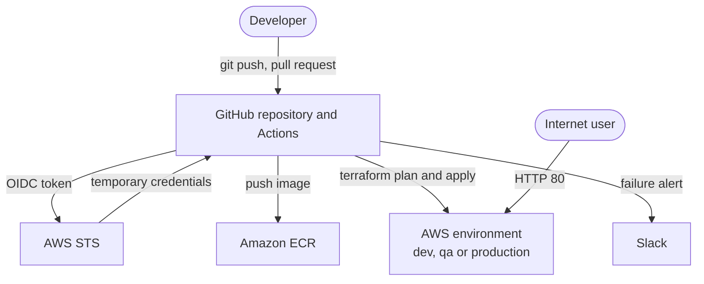
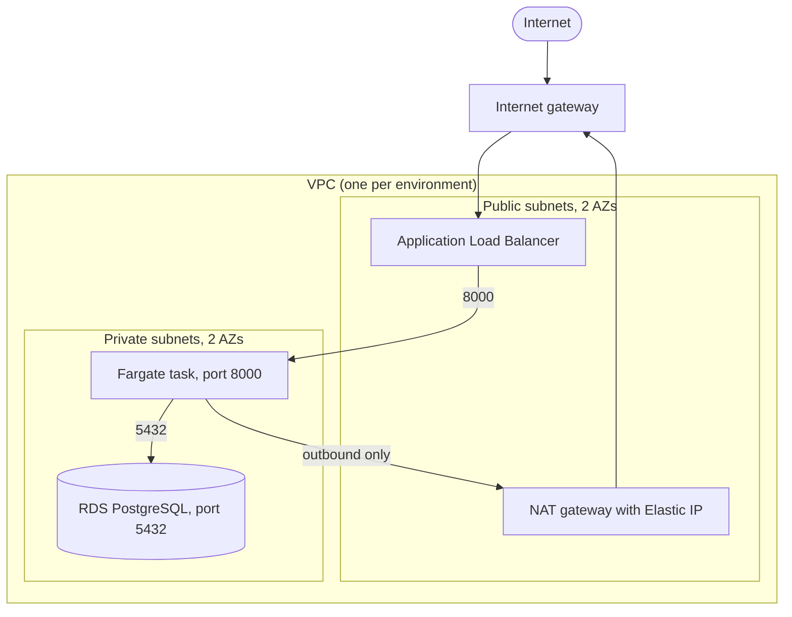
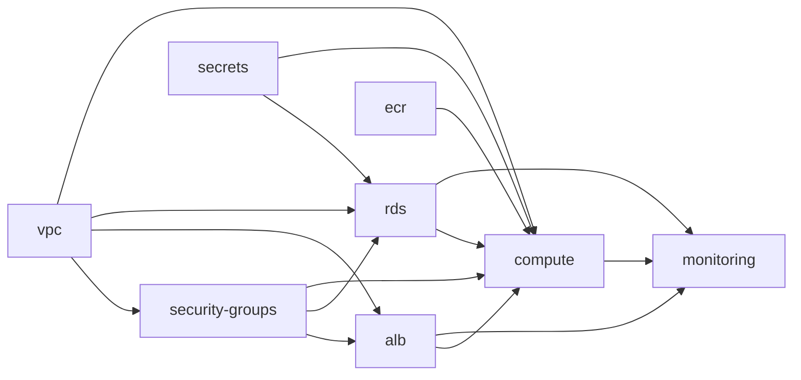
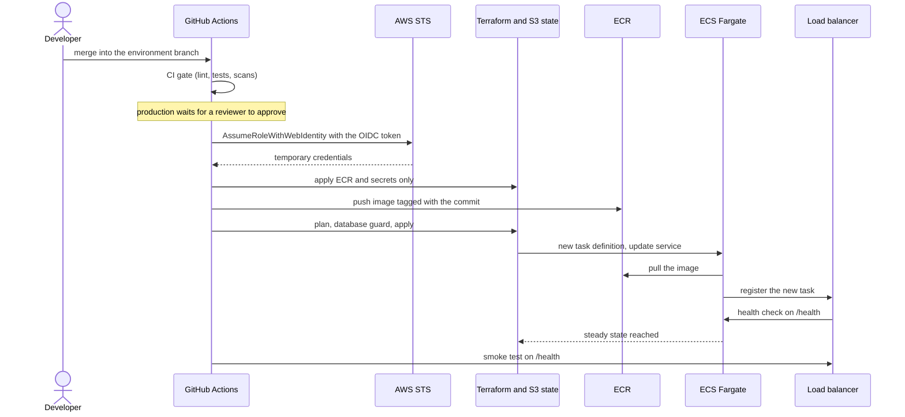

# Architecture

This document explains how the system is put together and why. For setup and day-to-day operation see the [README](../README.md) and the [runbook](runbook.md).

## 1. Overview

Three identical environments (dev, qa, production) run the same small web application on AWS. Each one is a separate network with its own database, load balancer and Terraform state, built from shared Terraform modules and deployed by a GitHub Actions pipeline.

| Concern | Choice |
|---|---|
| Region | ap-south-1 (Mumbai) |
| Compute | ECS on Fargate |
| Database | RDS PostgreSQL 16 |
| Entry point | Application Load Balancer |
| Provisioning | Terraform with an S3 backend |
| Delivery | GitHub Actions with OIDC |
| Observability | CloudWatch logs, metrics and dashboards |

## 2. Network design

One VPC per environment, with non-overlapping address ranges so the environments could be peered later.

| Environment | VPC CIDR | Public subnets | Private subnets |
|---|---|---|---|
| dev | 10.0.0.0/16 | 10.0.1.0/24, 10.0.2.0/24 | 10.0.11.0/24, 10.0.12.0/24 |
| qa | 10.1.0.0/16 | 10.1.1.0/24, 10.1.2.0/24 | 10.1.11.0/24, 10.1.12.0/24 |
| production | 10.2.0.0/16 | 10.2.1.0/24, 10.2.2.0/24 | 10.2.11.0/24, 10.2.12.0/24 |

Each pair of subnets spans two availability zones (ap-south-1a and ap-south-1b).

### Routing

| Route table | Associated with | Routes |
|---|---|---|
| Public | both public subnets | local, `0.0.0.0/0` to the internet gateway |
| Private | both private subnets | local, `0.0.0.0/0` to the NAT gateway |

The `local` route is created by AWS in every route table and is what lets the load balancer reach the task and the task reach the database inside the VPC. The unused main route table of each VPC is left untouched on purpose, so no subnet silently depends on it.

### Security groups

Each tier accepts traffic only from the tier in front of it, referenced by security group, never by IP range.

| Security group | Inbound | Outbound |
|---|---|---|
| `<env>-alb-sg` | TCP 80 from `0.0.0.0/0` | all |
| `<env>-app-sg` | TCP 8000 from `<env>-alb-sg` only | all (reaches the database, ECR, SSM and CloudWatch through the NAT gateway) |
| `<env>-rds-sg` | TCP 5432 from `<env>-app-sg` only | none defined |

## 3. Request and data flows

| Flow | Path |
|---|---|
| User request | Internet, internet gateway, load balancer (80), task (8000), database (5432) |
| Health check | Load balancer polls `GET /health` on each task. The endpoint does not query the database, so a database problem does not take every task out of rotation |
| Image pull | Task start, ECR, through the NAT gateway |
| Secrets | At task start ECS reads `/<env>/db/username` and `/<env>/db/password` from SSM using the **execution role**, and injects them as `DB_USER` and `DB_PASSWORD` |
| Application logs | Container stdout, CloudWatch log group `/ecs/<env>-app` |
| Access logs | Load balancer, S3 bucket `<env>-alb-access-logs-<account>` (encrypted, public access blocked, 14-day expiry) |
| Metrics | ECS Container Insights, RDS and load balancer metrics, shown on the dashboards |

## 4. Components

### Load balancer

Internet-facing Application Load Balancer in the public subnets with an HTTP listener on port 80 forwarding to a target group of type `ip` on port 8000 (required for Fargate, whose tasks register by network interface address). Health checks use `/health`. Invalid header fields are dropped, and deletion protection is controlled by a variable.

### Compute

| Setting | Value |
|---|---|
| Launch type | Fargate, Linux x86_64 |
| Size | 0.25 vCPU, 512 MB |
| Desired count | 1 (variable `app_desired_count`) |
| Placement | private subnets, no public IP |
| Deployment | minimum healthy 100%, maximum 200%, health check grace period 60 seconds |
| Safety | deployment circuit breaker with automatic rollback, Terraform waits for a steady state |
| Roles | an **execution role** (pull image, write logs, read the two SSM parameters). There is no task role because the application calls no AWS APIs |
| Image | built from `app/Dockerfile`, python 3.12 slim, OS packages upgraded at build, non-root user, tagged with the short commit hash |

### Database

RDS PostgreSQL 16 on `db.t3.micro`, 20 GB gp3, storage encrypted, placed in a DB subnet group made of the private subnets, not publicly accessible. Automated backups are enabled with the retention set by a variable. `multi_az` and `skip_final_snapshot` are variables too, so production-grade values can be switched on without changing the module.

### Image registry

One ECR repository per environment (`<env>-app`) with scan on push, AES-256 encryption and a lifecycle rule keeping the last 10 images. Retained images double as a rollback history.

### Secrets

`random_password` generates the database password. It is stored as an SSM `SecureString`, and the username as a `String`. The same SSM values feed both the database (at creation) and the task (at start), so there is one source of truth.

## 5. Terraform architecture

### Layers

| Layer | Folder | Applied by | State |
|---|---|---|---|
| Foundation | `terraform/bootstrap` | a person, once, rarely | **local file** |
| Workloads | `terraform/environments/<env>` | the pipeline | S3, one key per environment |
| Blueprints | `terraform/modules/*` | never directly, only called by an environment | n/a |

The foundation holds the state bucket, the lock table, the GitHub OIDC provider and the deploy roles. It is kept out of the pipeline for two reasons: the pipeline needs these things before it can log in at all, and a pipeline that could edit its own roles could widen its own permissions.

### Module dependencies

Arrows mean "feeds values into". Values travel only through module outputs and variables (`module.vpc.private_subnet_ids` and so on), which is also how Terraform works out the creation order.

### State layout

| Item | Value |
|---|---|
| Bucket | one shared bucket, versioned, encrypted, public access blocked |
| Keys | `dev/terraform.tfstate`, `qa/terraform.tfstate`, `production/terraform.tfstate` |
| Locking | DynamoDB table with key `LockID` (the S3 backend's newer native locking is a listed next step) |
| Contains | resource IDs and the generated password, which is why the bucket is locked down |

## 6. CI/CD architecture

### Deployment sequence

### Identity and access

| Role | Who can assume it | Permissions |
|---|---|---|
| `github-actions-dev` | workflow runs on branch `develop` of this repository | PowerUserAccess, IAM only on roles named `dev-*`, PassRole to ECS tasks only |
| `github-actions-qa` | workflow runs on branch `qa` | same shape, `qa-*` |
| `github-actions-production` | jobs that run in the `production` GitHub environment (after approval, branch `main` only) | same shape, `production-*` |
| `<env>-app-execution-role` | the ECS service | managed ECS execution policy plus read of the two SSM parameters |

Trust conditions match the token's `aud` and `sub` exactly. The subject includes GitHub's immutable numeric owner and repository IDs, so a deleted and recreated repository with the same name could not assume these roles.

### Promotion model

`develop` deploys dev, `qa` deploys qa, `main` deploys production. Code is promoted by pull request, so the same Terraform and application code moves through the environments. Each environment currently builds its own image from source. Promoting one built image through the stages is a listed improvement.

## 7. Observability

| Signal | Source | Where to look |
|---|---|---|
| Application logs | stdout of the container | log group `/ecs/<env>-app`, and the logs table on the application dashboard |
| Access logs | load balancer | S3 bucket `<env>-alb-access-logs-<account>` |
| Compute metrics | ECS and Container Insights | `<env>-infrastructure` dashboard |
| Database metrics | RDS | `<env>-infrastructure` dashboard |
| Traffic and errors | load balancer metrics | `<env>-application` dashboard (request rate, 5XX error rate, latency average and p95, healthy and unhealthy targets) |
| Pipeline failures | GitHub Actions | Slack alert with commit, author and run link |

There are dashboards but no CloudWatch alarms yet, so a runtime problem is found by looking, not by being paged. Alarms and an SNS topic are in the next steps.

## 8. Availability, failure modes and limits

| Failure | Current behaviour | Improvement |
|---|---|---|
| A task crashes | ECS starts a replacement, the load balancer stops sending traffic to the unhealthy one | Run two or more tasks |
| A bad release | The circuit breaker rolls the service back, the smoke test fails the pipeline and an alert goes out | Build once and promote the verified image |
| Availability zone outage | Load balancer and subnets span two zones, but the single task, the single-AZ database and the single NAT gateway are each in one zone | Multi-AZ database, more tasks, a NAT gateway per zone |
| Database failure | Restore from automated backup | Multi-AZ, longer retention |
| NAT gateway failure | Tasks cannot pull images or reach SSM when they next start, running tasks keep serving | NAT per zone |
| Region outage | Not covered | A second region, out of scope |
| Pipeline outage | Deploys stop, running systems are unaffected | Documented manual procedure in the runbook |
| Leaked deploy credentials | None exist to leak, credentials are short-lived | n/a |

**Account limits observed.** The AWS free plan caps the number of RDS instances. With dev and qa running, a third database was refused, so production was built after qa was destroyed. Dashboards beyond the first three per account are billed.

## 9. Decisions and trade-offs

| Decision | Reason | Cost of the choice |
|---|---|---|
| Separate stacks per environment | Isolation, a mistake in one cannot touch another | More resources and cost |
| Modules plus environment folders, not workspaces | Differences are explicit in pull requests | Small duplicated files |
| Fargate | Nothing to patch or size | Higher unit cost at scale |
| One NAT gateway per environment | NAT is the biggest fixed cost | Single point of failure per environment |
| SSM Parameter Store | No per-secret charge | No automatic rotation |
| Terraform-generated password | No human handles it | It lives in state |
| OIDC, not access keys | Nothing long-lived to steal | Trust policy must match the token exactly |
| Bootstrap outside the pipeline | The pipeline cannot grant itself more access | Manual apply, local state |
| `/health` without a database check | A database blip does not cascade | The load balancer cannot see database problems |
| Public repository | Real approval gates need it on this plan | The code and account ID are visible, no credentials are |

## 10. Planned evolution

TLS with a domain and certificate, authentication on the API, CloudWatch alarms into Slack, multi-AZ database and autoscaling, image promotion instead of rebuilds, S3-native state locking, per-environment AWS accounts and tighter per-environment IAM, and policy and cost checks in CI.
